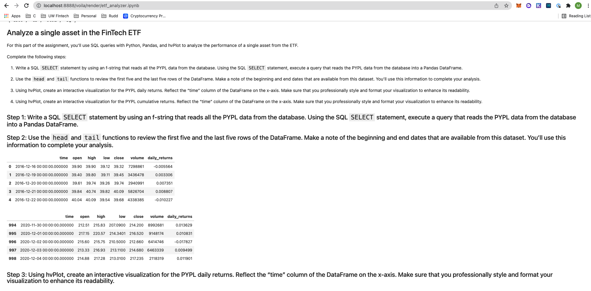
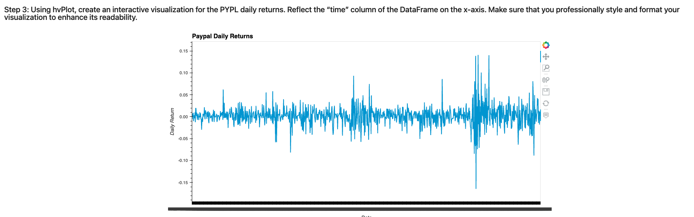
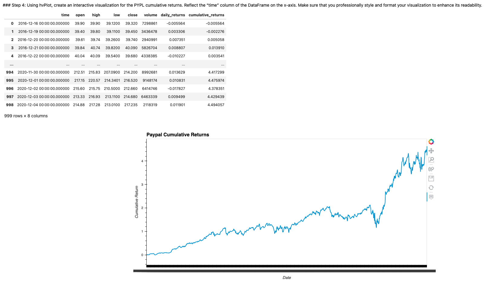
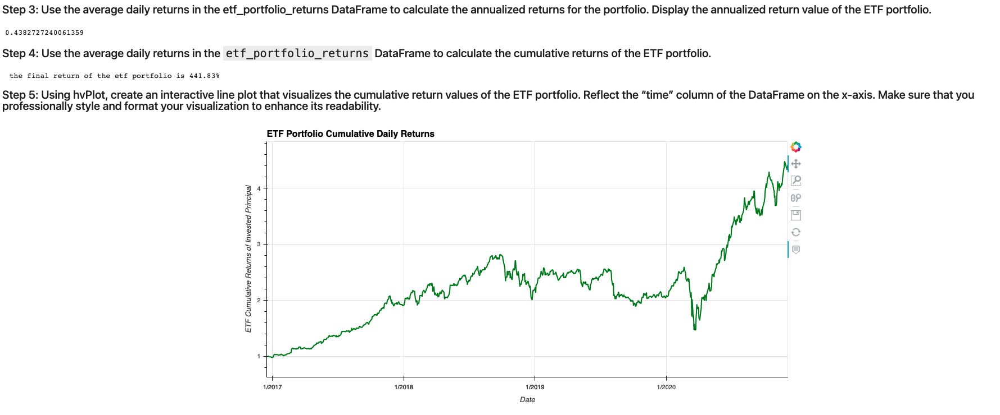

# Challenge Seven - ETF Portfolio

## Project Description
Using SQl and Pandas, analyze the portfolio of stocks by moving data from a database to a dataframe.  The end result of the project was to find the cumulative returns of the test portfolio.

## Project Libraries
-Numpy
-Pandas
-HVplot
-SQL

## Voila Screenshots 

## Contributors
Matthew P Rudd - mprudd2@gmail.com

## License 
MIT